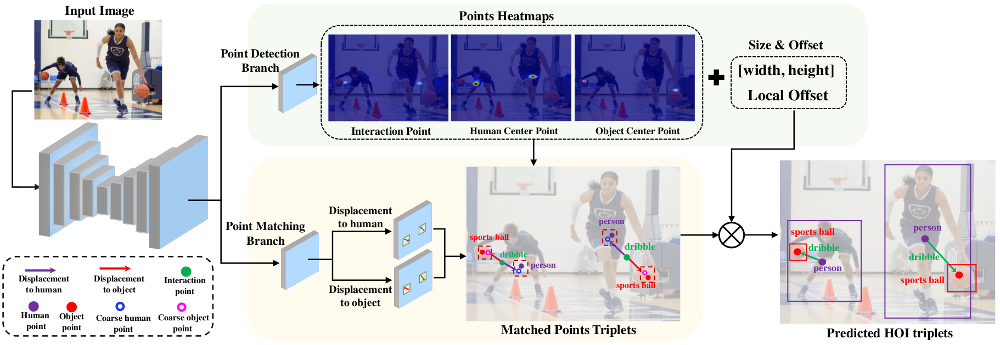

# PPDM
Code for our CVPR 2020 paper "[PPDM: Parallel Point Detection and Matching for Real-time Human-Object
Interaction Detection](https://arxiv.org/pdf/1912.12898)".

Contributed by [Yue Liao](yueliao.github.io), [Si Liu](http://colalab.org/people), Fei Wang, Yanjie Chen, Chen Qian, [Jiashi Feng](https://sites.google.com/site/jshfeng/).



## Checklist
- [x] Training code and test code on HICO-Det dataset. (2020-03-11)
- [x] Training code and test code on HOI-A dataset. (2020-03-11)
- [ ] HOI-A dataset.
- [ ] Image demo.
- [ ] Video demo.
- [ ] PPDM for video HOI detection.
- [ ] PPDM for human-centric relationship segmentation.


## Getting Started
### Installation
   The code was tested on Ubuntu 16.04, with Python 3.6 and PyTorch v0.4.1.

1. Clone this repository.

    ~~~
    git clone https://github.com/YueLiao/PPDM.git $PPDM_ROOT
    ~~~
2. Install pytorch0.4.1.

    ~~~
    conda install pytorch=0.4.1 torchvision -c pytorch
    ~~~
3. Install the requirements.
    
    ~~~
    pip install -r requirements.txt
    ~~~
4. Compile deformable convolutional (from [DCNv2](https://github.com/CharlesShang/DCNv2/tree/pytorch_0.4)).

    ~~~
    cd $PPDM_ROOT/src/lib/models/networks/DCNv2
    ./make.sh
    ~~~
### Demo
1. Image Demo

2. Video Demo


## Training and Test
### Dataset Preparation
1. Download [HICO-Det](https://drive.google.com/open?id=1QZcJmGVlF9f4h-XLWe9Gkmnmj2z1gSnk) datasets. Organize them in `Dataset` folder as follows:

    ~~~
    |-- Dataset/
    |   |-- <dataset name>/
    |       |-- images
    |       |-- annotations
    ~~~
2. Download the pre-processed annotations for HICO-Det from the [[websit]](https://drive.google.com/open?id=1WI-gsNLS-t0Kh8TVki1wXqc3y2Ow1f2R) and replace the original annotations in `Dataset` folder. The pre-processed annotations including

    ~~~
    |-- anotations/
    |   |-- trainval_hico.json
    |   |-- test_hico.json
    |   |-- corre_hico.npy
    ~~~
    The `trainval_hico.json` and `test_hico.json` are the "HOI-A format" annotations generated from [iCAN annotation](https://drive.google.com/open?id=1le4aziSn_96cN3dIPCYyNsBXJVDD8-CZ). `corre_hico.npy` is a binary mask, if the `ith category of object ` and the ` jth category of verb` can form an HOI label, the value at location (i, j) of `corre_hico.npy` is set to 1, else 0.

### Training
1. Download the corresponding pre-trained models trained on COCO object detection dataset provided by  [CenterNet](https://github.com/xingyizhou/CenterNet). ([Res18](https://drive.google.com/open?id=1b-_sjq1Pe_dVxt5SeFmoadMfiPTPZqpz), [DLA34](https://drive.google.com/open?id=1pl_-ael8wERdUREEnaIfqOV_VF2bEVRT), [Hourglass104](https://drive.google.com/open?id=1-5bT5ZF8bXriJ-wAvOjJFrBLvZV2-mlV)). Put them into the `models` folder.

2. The scripts for training in `experiments` folder.  An example traning on HICO-DET dataset as follow:

    ~~~
    cd src
    python main.py  hoidet --batch_size 112 --master_batch 7 --lr 4.5e-4 --gpus 0,1,2,3,4,5,6,7  --num_workers 16  --load_model ../models/ctdet_coco_dla_2x.pth --image_dir images/train2015 --dataset hico --exp_id hoidet_hico_dla
    ~~~
### Test
1. Evalution by our rewritten script and select the best checkpoint. The scripts for evalution are put into `experiments` folder.  An example evalution on HICO-DET dataset as follow:

    ```
    cd src
    python test_hoi.py hoidet --exp_id hoidet_hico_dla --gpus 0 --dataset hico --image_dir images/test2015 --test_with_eval
    ```
    
    or directly generating the predictions and evalutating for a certern checkpoint:
    
    ```
    cd src
    python test_hoi.py hoidet --exp_id hoidet_hico_dla --load_model ../exp/hoidet/hoidet_hico_dla/model_140.pth --gpus 0 --dataset hico --image_dir images/test2015 --test_with_eval
    ```
    
2. For HICO-DET official evalution.
    
    The mAPs evaluated by our provided scripts are a bit lower (about 0.5% mAP)  than the official evaluation script.

- Setup HICO-DET evaluation code:

    ~~~
    cd src/lib/eval
    sh set_hico_evalution.sh
    ~~~
- Evaluate your prediction:

    ~~~
    cd src/lib/eval
    python trans_for_eval_hico.py best_predictions.json
    cd ho-rcnn
    matlab -r "Generate_detection.m; quite"
    ~~~
## Results on HICO-DET and HOI-A
We donot carefully tune the training hyper-parameters just following the setting in [Centernet](https://github.com/xingyizhou/CenterNet), e.g., lr, loss_weight, max_epoch, which may not be the best choice for our PPDM. It causes that the last checkpoint may not be the best one. We report two results and provide the corresponding two models for each setting, i.e. last checkpoint (the former, reported in paper) and best checkpoint.   

**Our Results on HICO-DET dataset**


|Model| Full (def)| Rare (def)| None-Rare (def)|Full (ko)| Rare (ko)| None-Rare (ko)|FPS|Download|
|:---:|:---:|:---:|:---:|:---:|:---:|:---:|:---:|:---:|
|res18| 14.90|	7.61|	17.08|	17.31	|9.79|19.55|**89**|[model](https://drive.google.com/open?id=1o4Z8Ts275hu4j4bXpQf1ftgdWR2ng7LN)|
|dla34| 19.94/20.06	|13.01/13.32|	22.01/22.08	|22.63/22.73|	15.93/16.29	|24.63/24.65|38|[model](https://drive.google.com/drive/folders/1K0H05nSUOCq939tmvBRJjskdPSLy1U-U?usp=sharing)|
|dla34_3level|20.00/20.15|12.56/13.48|22.22/22.15	|	22.65/22.91|15.02/16.18|	24.93/24.91|37|[model](https://drive.google.com/open?id=1NaFJLe-c_m1iFv-STHYtpROvXEJhp6_t)|
|dla34_glob|19.85/19.85	|12.99/12.99|	21.90/21.90|	22.49/22.49|	15.86/15.86|	24.47/24.47|38|[model](https://drive.google.com/open?id=1v98JF5_191SfR_a7WspBeynjvfL3h9X1)|
|dla34_glob_3level|20.29/20.41	|13.06/13.34|	22.45/22.52|	23.09/23.16|	16.14/16.24|	25.17/25.23|37|[model](https://drive.google.com/open?id=1cThMBlwe19HAQ_wxVlb881VT8S60AAlA)|
|hourglass104|**21.73/21.94**|	**13.78/13.97**|	**24.10/24.32**|	**24.58/24.81**|	**16.65/17.09**|	**26.84/27.12**|14|[model](https://drive.google.com/open?id=1rRgblZUa2Z85V_b0H678xR1HwZGEdl0B)|

**Our Results on HOI-A dataset**

Coming soon.

## Citation
Please consider citing this project in your publications if it helps your research. The following is a BibTeX reference. The BibTeX entry requires the url LaTeX package.

~~~
@inproceedings{liao2019ppdm,
  title={PPDM: Parallel Point Detection and Matching for Real-time Human-Object Interaction Detection},
  author={Liao, Yue and Liu, Si and Wang, Fei and Chen, Yanjie and Qian, Chen and Feng, Jiashi},
  booktitle={CVPR},
  year={2020}
}
~~~
## License
PPDM is released under the MIT license. See [LICENSE](LICENSE) for additional details.
## Acknowledge
Some of the codes are built upon [Objects as Points](https://github.com/xingyizhou/CenterNet) and [iCAN](https://github.com/vt-vl-lab/iCAN). Thanks them for their great works!

